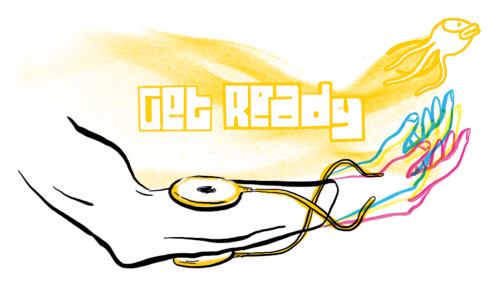

# 01-myocoach


[TOC]



---

The **MyoCoach** is a device for upper limb amputees who wish to wear a myoelectric prosthesis. It allows you to practice the contraction of the forearm muscles thanks to a video game inspired by Flappy Bird, and to train the control of the future prosthesis.

The MyoCoach can also be used by health professionals, particularly prosthetist (CPO) and occupational therapists, as it allows the myoelectric sensors to be placed correctly and adjusted for optimal use of myoelectric prostheses.

The MyoCoach makes it possible to :

* Measure muscle potential with the help of myoelectric sensors
* Define the optimal sensor position
* Adjusting the sensors using potentiometers
* Exercise in muscle contraction and coordination

The **MyoCoach** is made up of different elements :

* 2 EMG sensors to read the patient's myoelectric signals (EMG)
* 1 box to transfer data to the computer with an Arduino Board
* A holder to hold the sensors on the patient's arm
* A PC to run the UI application for EMG data visualization

> :warning: Today, the MyoCoach uses sensors from the brand Ottobock (Ref 13E202). One day, ORTHOPUS will propose one, but not at the price of 1000€ !
> 

## Warning notice before starting

The versions of our solutions reproduced in Do It Yourself do not have the CE marking. It can only be apply to solutions developed and sold by ORTHOPUS which follow the regulations in force.
ORTHOPUS cannot guarantee the “quality” of solutions replicated by third parties thanks to documentation shared on github.

## D.I.Y Level

:star: :star:

**Required devices** : to make your own Myo coach, we will need a 3D printer and some basics electronics tools like a soldering iron + soldering accessories (you will find a detailed list of equipment in the [user manual](./docs/user-manual.md).

## How to make your own

We give more details about how to get the best experiences with the **Myo Coach** in the [user manual](./docs/user-manual.md).

You can design the MyoCoach for less than **30€**. More details in the [COSTS](COSTS.md) file.

Follow this steps to make your own **Myo Coach**

**:one: Download the src**

Dowload the [latest release](https://github.com/orthopus/0102-myocoach-diy/releases/latest)

or clone the **0102-myocoach-diy** repository

```bash
$ git clone https://github.com/orthopus/0102-myocoach-diy.git
```

**:two: Make the box**

Follow the [manufacturing manual](./docs/manufacturing-manual.md)

**:three: Flash the Arduino Board**

Follow the [firmware programming manual](./docs/firmware-programming-manual.md)

**:four: Install the Desktop GUI**

Follow the [UI programming manual](./docs/ui-programming-manual.md)


## Contribution
Your contribution to the MyoCoach project is welcome!

* Have you discovered a bug or you have an improvement ideas ?
  * Go to the GitHub [issues](https://github.com/orthopus/0102-myocoach-diy/issues) of the project.
* You have time, some Maker skills and you want to help us ?
  * Read the [CONTRIBUTING](CONTRIBUTING.md) file to help us to go to the **Myo Coach v2.0**
  * Read the [CODEOFCONDUCT](CODEOFCONDUCT.md) file to know community standards

## Contact

If you wish to contact us, you can send a message to contact@orthopus.com
