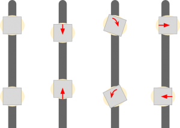
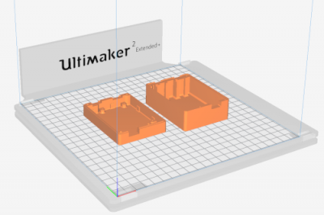
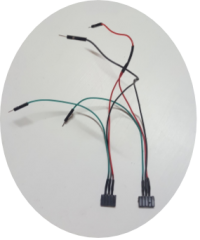
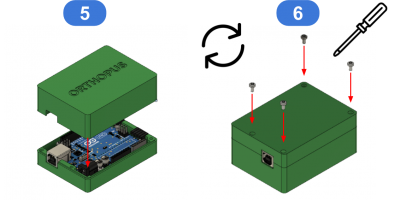

# 0113-MyoCoach-DIY : <br> Manufacturing Manual

In this manual you will find all the resources to design the various components of the MyoCoach.

* The [armband](#armband)
* The Arduino board [casing](#casing)

## List of equipment
To design the MyoCoach, you will need :

* A 3D printer
* PLA type filament
* An Arduino UNO type card ([link](https://store.arduino.cc/arduino-uno-rev3))
* A female pin header strip [link](https://fr.farnell.com/samtec/ssq-110-03-f-s/connect-femelle-10-voies-1-rang/dp/2667433)
* A male pin header strip [link](https://fr.farnell.com/amp-te-connectivity/1-826629-0/barrette-droite-1-rangee-10voies/dp/3418376)
* A set of electronic cables [link](https://fr.farnell.com/pro-signal/psg-jws-65/jumper-wire-set-65pc/dp/2503764?MER=bn_level5_5NP_EngagementRecSingleItem_3)
* Self-tapping screws 8 x ∅2.2-L5 [link](https://www.visseriefixations.fr/catalog/product/view/id/38717)
* A strap with velcro and buckle [link](https://www.amazon.fr/gp/product/B07G9XFYM4/ref=ppx_yo_dt_b_asin_title_o05_s00?ie=UTF8&psc=1)

Tools :

* A Phillips screwdriver
* A soldering iron + soldering accessories
* A tube of glue type Glue

<a name="armband"></a>
## The ArmBand
The armband is the component of the MyoCoach that holds the two Ottobock EMG sensors (Ref 13E202) on the residual limb of the future prosthesis user. This armband is comfortable, inexpensive and facilitates the positioning of the sensors for the ortho-prosthetist.

### Printing of the Sensor Supports
The supports have been made with Fusion360 software.

The file in .STL format is available in [src/hardware/casing](../src/hardware/casing)


### armband assembly
Prepare the different elements: the printed material, the strap and the EMG sensor.


* :one: Insert the strap into the side openings of the media. 

```diff
# INFO
# The strap must be forced in.
```

* :two: Insert the Ottobock 13E202 sensor into the holder, taking care to force the strap between the holder and the sensor.

```diff
# INFO
# The sensor must go at the end of the mechanical stop in the holder.
```
 
### Adjustments and positioning
The design of the sensor holder and especially the design of the slot where the cable passes through offers a certain freedom of positioning between the two sensors. This freedom of movement allows the two EMG sensors to be correctly positioned above the user's muscle areas.



<a name="casing"></a>
## The Casing
The MyoCoach's case allows EMG sensor data to be acquired with an Arduino card and transferred to a computer for visualisation. It also allows the Ottobock electrode connector format to be adapted to the MyoCoach casing.

### Casing printing
The casing of the Arduino Board has been made with Fusion360 software.

STL format files are available in [src/hardware/casing](../src/hardware/casing)



### Preparation of the Arduino card
The main idea is to solder two female connectors (5-pin female pin header strips) to adapt to the female connectors of the Ottobock 13E202 sensors. The connectors are connected to the analogue ports A0 (EMG 0) and A1 (EMG 1) of the Arduino board.

The wiring diagram is as follows:


The result is as follows:



### Casing Assembly
Prepare the following items: the Arduino card, the two parts of the case, the female pin header strips and the 8 self-tapping screws.


* :one: Insert the Arduino card into the case.

* :two: Screw in the 4 self-tapping screws to hold the Arduino card in the case.


* :three: Using pliers, cut off the 2 outer pins of the snap-off strips.

* :four: To hold the connectors in place in the box, apply 2 drops of glue (Glue type) before placing the connectors in the box.

```diff
# INFO
# The cables are not shown in these illustrations but at this stage 
# the connectors must be soldered.
```



* :five: Close the housing

```diff
! WARNING 
! Before closing the case, the connectors must be connected to the 
! Arduino board (+5v, GND, EMG0 → A0, EMG1 → A1).
```

* :six: Turn the MyoCoach housing over and screw in the 4 self-tapping screws to hold the two housing covers in place.

### Electrode Connector
The connector of the Ottobock 13E202 electrodes is very specific.


But a simple 3-pin header strip is used to interface between the electrodes and the connectors of the MyoCoach box.


